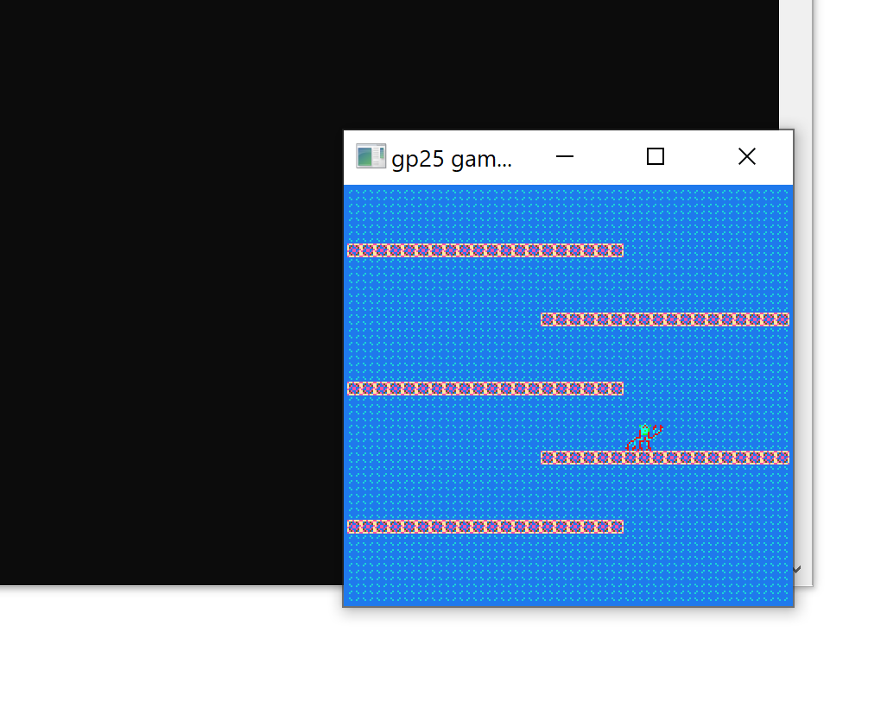

# Crabman

Author: Johnny Zhang

Design: Crabman could shoot up his claw and latch onto ceilings, which enables him to scale heights dispite his inablity to jump due to tiny feet.
What I think makes it interesting is that I made what I think is a smooth and intuitive control scheme with muitiple functionalities 
(climb,reach,drop,stop reaching) with only the arrow keys

Screen Shot:

How Your Asset Pipeline Works:

(TODO: describe the steps in your asset pipeline, from source files to tiles/backgrounds/whatever you upload to the PPU466.)
The sprites (crabman bodyparts, terrain, background)used are exported using GIMP as 8x8 pixel pngs. The c++ load function I wrote imports them 
and create a color palette based on the png and also the corresponding PPU466::Tile instantiations. I manually assigned them to the tile_table and palette_table in PlayMode.cpp.

(TODO: make sure the source files you drew are included. You can [link](your/file.png) to them to be a bit fancier.)

How To Play:

(TODO: describe the controls and (if needed) goals/strategy.)
Use arrow keys to crabwalk, use up to shoot up your claw and down to get down.

This game was built with [NEST](NEST.md).

